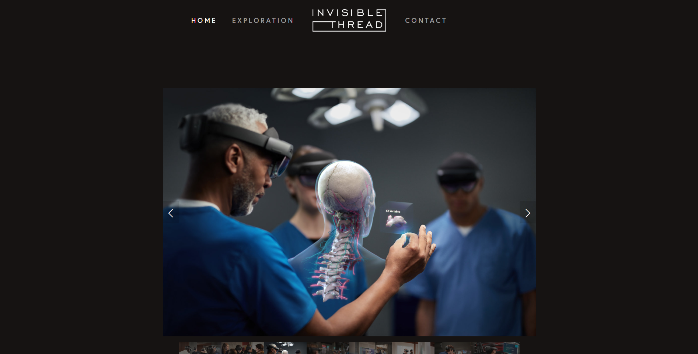
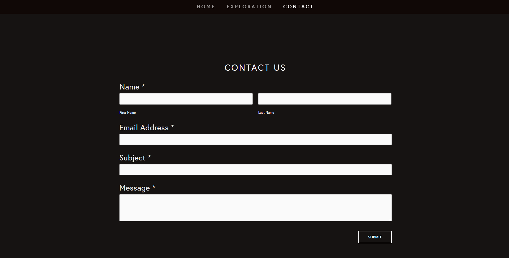

# Invisible Thread Website Update

# PROJECT DESCRIPTION
***In progress***

**Project’s Purpose or Goal:**
Interned at Invisible Thread (a small boutique studio that creates high end holographic content. AR, VR, and projection mapping) with two other students. Tasked with redesigning their website which is currently a simple Square Space website. We collaborated with the guys at Invisible Thread to come up with a user story where you are initially met with what appears to be a regular 2d website - then once you start scrolling you enter a 3D space in which you can explore floating tiles that project their work. The idea was to create interest in the work that is done at Invisible Thread without spelling it out in piles of text. Finally you will be met again with a 2D contact form where you can further connect.  

## ORIGINAL WEBSITE SCREEN SHOTS

## CURRENT PROGRESS CAPTURE

## AUTHOR

-   **Kaya Jepson**
-   **Todd Aden**
-   **Mike Larragueta**
